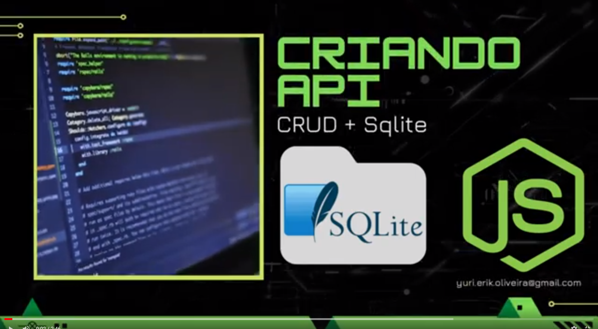

# API Node.js com Sqlite

Esse repositório contém o resultado de um passo a passo que está no YouTube onde eu explico como desenvolvemos uma API com Node.js.
Para quem quiser acompanhar a playlist do YouTube, acesse:

Utilizamos:
- Express
- Express Router
- Cors
- Https
- Sqlite

Nós desenvolvemos uma API simples porém estruturada com rotas, controladore e conexão com banco de dados. Como o objetivo foi compartilhar conhecimento e contribuindo com quem está aprendendo ou quer reforçar conhecimento, desenvolvi um CRUD minimalista de Pessoas, deixando aberto para quem quiser complementar com as colunas e tabelas que desejarem.

Espero que o projeto tenha ficado de fácil entendimento e caso tenham dúvidas, não exitem em entrar em contato, ficarei feliz em ajudar e ver o resultado dos projetos.

Se precisarem entrar em contato, segue meu e-mail: yuri.erik.oliveora@gmail.com
